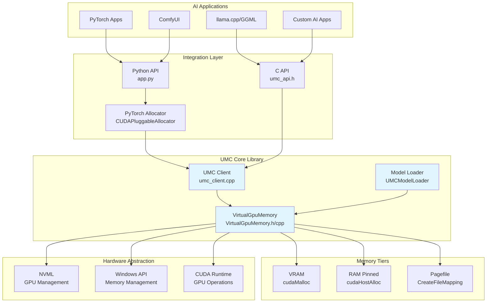
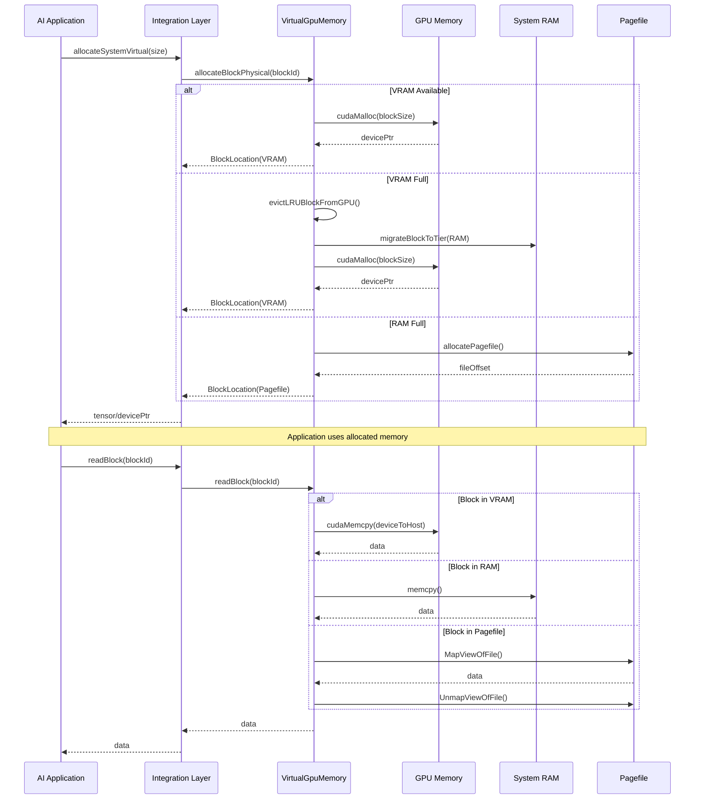

# UMC (Unified Memory Controller) Architecture Diagram

## System Overview

The UMC system is a unified memory management solution for Windows that transparently extends GPU VRAM using system RAM and pagefile storage, enabling AI applications to run models larger than available VRAM.

## High-Level Architecture



## Component Details

### 1. AI Application Layer
- **PyTorch Apps**: Standard PyTorch applications using CUDA tensors
- **ComfyUI**: UI-based AI workflow tool (primary use case)
- **llama.cpp/GGML**: LLM inference engine
- **Custom AI Apps**: Any AI application needing memory management

### 2. Integration Layer

#### Python API (`app.py`)
- **Purpose**: Python interface for PyTorch integration
- **Key Functions**:
  - `initialize_virtual_capacity()`: Set up VRAM + RAM capacity
  - `allocateSystemVirtual()`: Allocate memory with tier decision
  - `enable_cuda_pinning()`: Enable fast CUDA transfers
  - `tier_manager_decide_tier_and_allocate()`: Hook for tier management
  - `get_memory_stats()`: Memory usage statistics

#### C API (`umc_api.h`)
- **Purpose**: C-compatible API for external integration
- **Key Functions**:
  - `UMC_Init()`: Initialize UMC with parameters
  - `UMC_Destroy()`: Cleanup UMC instance
  - `UMC_WriteBlock()`/`UMC_ReadBlock()`: Block-level I/O
  - `UMC_MigrateBlockToTier()`: Move blocks between tiers
  - `UMC_IsThrashingDetected()`: Detect memory thrashing

#### PyTorch Allocator (`CUDAPluggableAllocator`)
- **Purpose**: Direct PyTorch memory allocator integration
- **Implementation**: `umc_alloc()` and `umc_free()` in `umc_client.cpp`
- **Integration**: Replaces PyTorch's default CUDA allocator

### 3. UMC Core Library

#### VirtualGpuMemory Class (`VirtualGpuMemory.h/cpp`)
- **Purpose**: Core memory management engine
- **Key Responsibilities**:
  - Block allocation across memory tiers
  - LRU eviction policy
  - Thrashing detection
  - Block migration between tiers
  - Access tracking and statistics

**Key Data Structures**:
```cpp
enum class MemoryTier { Vram, Ram, Pagefile };

struct BlockLocation {
    MemoryTier tier;
    int deviceId;
    size_t physicalOffset;
    size_t size;
    bool isPinned;
    size_t lastAccessTime;
};
```

**Core Algorithms**:
- **Tier Selection**: VRAM → RAM → Pagefile fallback
- **LRU Eviction**: `evictLRUBlockFromGPU()` for VRAM management
- **Thrashing Detection**: Monitors migration patterns
- **Working Set Estimation**: Predicts memory access patterns

#### UMC Client (`umc_client.cpp`)
- **Purpose**: C API wrapper around VirtualGpuMemory
- **Key Functions**:
  - Context management (UMC_Context)
  - C-to-C++ bridge functions
  - PyTorch allocator implementation

#### Model Loader (`UMCModelLoader`)
- **Purpose**: Load model files into virtual memory
- **Implementation**: Sequential chunk loading
- **File Format**: Binary model files (e.g., .safetensors)

### 4. Memory Tiers

#### Tier 0: VRAM
- **Implementation**: `cudaMalloc()` for GPU memory
- **Use Case**: Hot data, frequently accessed blocks
- **Budget**: Configurable (default: 80% of free VRAM)
- **Management**: LRU eviction when full

#### Tier 1: RAM Pinned
- **Implementation**: `cudaHostAlloc()` for pinned memory
- **Use Case**: Warm data, staging buffer for transfers
- **Budget**: Configurable (default: 50% of available RAM)
- **Advantage**: Fast GPU transfers via PCIe

#### Tier 2: Pagefile
- **Implementation**: `CreateFileMapping()` with pagefile backing
- **Use Case**: Cold data, infrequently accessed blocks
- **Budget**: Configurable (default: 256MB or half available pagefile)
- **Advantage**: Large capacity, slower access

### 5. Hardware Abstraction

#### NVML (NVIDIA Management Library)
- **Purpose**: GPU device enumeration and memory queries
- **Functions**: 
  - Device detection
  - VRAM capacity/free space
  - GPU name and properties

#### Windows API
- **Purpose**: System memory management
- **Functions**:
  - `GlobalMemoryStatusEx()`: RAM information
  - `GetPerformanceInfo()`: Pagefile information
  - `VirtualAlloc()`: RAM allocation
  - `CreateFileMapping()`: Pagefile allocation

#### CUDA Runtime
- **Purpose**: GPU memory operations
- **Functions**:
  - `cudaMalloc()`: VRAM allocation
  - `cudaMemcpy()`: Memory transfers
  - `cudaStreamCreate()`: Async operations
  - `cudaSetDevice()`: Multi-GPU support

## Data Flow Diagram



## Memory Management Flow

### Block Allocation Flow
1. **Request**: Application requests memory allocation
2. **Tier Decision**: VirtualGpuMemory decides optimal tier
3. **Allocation**: Physical memory allocated in chosen tier
4. **Tracking**: Block metadata stored in page table
5. **Return**: Physical pointer returned to application

### Block Migration Flow
1. **Access Request**: Application requests block access
2. **Location Check**: Current tier determined
3. **Migration**: If not in VRAM, migrate to VRAM
4. **Eviction**: If VRAM full, evict LRU block
5. **Data Transfer**: Copy data between tiers
6. **Update**: Update block location metadata

### Thrashing Detection
1. **Monitor**: Track migration patterns
2. **Analyze**: Calculate migration frequency
4. **Response**: Force allocation to stable tiers (RAM/Pagefile)
5. **Recovery**: Return to normal operation when stable

## Build System

### CMake Configuration (`CMakeLists.txt`)
- **Language**: C++ with CUDA
- **Output**: Shared library (UMC.dll)
- **Dependencies**: CUDA, NVML, Windows APIs
- **Build Targets**: 
  - UMC library (shared)
  - Demo executable (main.cpp)

### Build Scripts
- `build.ps1`: Main build script
- `build_v*.ps1`: Version-specific build scripts
- `start_comfyui_with_umc.bat`: ComfyUI integration launcher

## Integration Points

### PyTorch Integration
```python
import torch
from torch.cuda.memory import CUDAPluggableAllocator

# Enable UMC allocator
allocator = CUDAPluggableAllocator('umc_client.dll', 'umc_alloc', 'umc_free')
torch.cuda.memory.change_current_allocator(allocator)
```

### C++ Integration
```cpp
#include "umc_api.h"

UMC_InitParams params = {4*1024*1024, 0, 0, 0};
UMC_Handle handle = UMC_Init(&params);

// Use UMC functions
UMC_WriteBlock(handle, blockId, data, size);
UMC_ReadBlock(handle, blockId, outData, size);

UMC_Destroy(handle);
```

### Python Integration
```python
import app

# Initialize virtual capacity
app.initialize_virtual_capacity(
    vram=4*1024**3,
    ram=8*1024**3
)

# Allocate memory
tensor = app.allocateSystemVirtual(size_bytes=1024)
```

## Key Features

1. **Transparent Tiering**: Automatic memory tier selection
2. **LRU Eviction**: Intelligent VRAM management
3. **Thrashing Detection**: Prevents performance degradation
4. **Multi-GPU Support**: Manages multiple GPU devices
5. **Working Set Estimation**: Predicts memory access patterns
6. **Prefetching**: Proactive data loading
7. **Page Fault Simulation**: Handles pagefile access
8. **CUDA Pinning**: Optimized GPU transfers
9. **Fallback Mode**: Works without CUDA for development

## Performance Characteristics

- **VRAM Access**: ~10-12 GB/s (PCIe 4.0 x16 theoretical)
- **RAM Access**: ~2-3 GB/s (NVMe Gen4)
- **Pagefile Access**: Slower, but large capacity
- **Migration Overhead**: Acceptable for inference, noticeable for interactive use

## Use Cases

1. **Large Model Inference**: Run models larger than VRAM
2. **ComfyUI Workflows**: Enable high-VRAM workflows on limited GPUs
3. **LLM Inference**: Run large language models on consumer GPUs
4. **Multi-Model Scenarios**: Load multiple models simultaneously
5. **Development**: Test models without hardware upgrades

## Limitations

1. **Windows Only**: Designed for Windows/WDDM
2. **Explicit Allocator**: Requires application integration
3. **Latency Overhead**: Not zero-overhead, but prevents OOM
4. **CUDA Required**: For GPU operations (fallback mode available)
5. **WDDM Constraints**: Cannot replicate Linux UVM features
